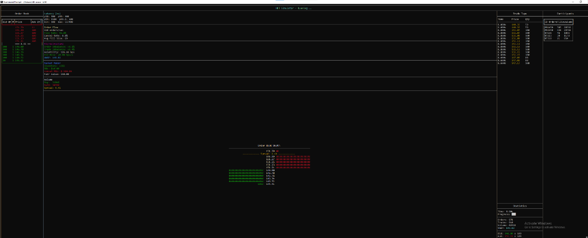

# HFT Market Simulator

A high-performance C++ limit order book and matching engine with real-time terminal dashboard, inspired by institutional trading systems.

**~2.8M orders/sec · 300ns p50 matching latency · 800ns p99**



## Features

### Core Engine
- **FIFO Limit Order Book** with O(1) order cancellation
- **Matching Engine** supporting LIMIT, MARKET, IOC, and FOK orders
- **Latency Instrumentation** with nanosecond precision timing
- **~2.8M orders/second** throughput on modern hardware

### Terminal Dashboard (`hft-ui`)
Real-time TUI with comprehensive HFT metrics:

| Panel | Metrics |
|-------|---------|
| **Order Book** | Live bid/ask depth with price levels |
| **Depth Histogram** | Visual order book imbalance |
| **Trade Tape** | Streaming executions with aggressor side |
| **Latency** | p50, p95, p99, p99.9 (nanoseconds) |
| **Microstructure** | Volatility, Order/Trade Imbalance, Mid Move |
| **Market Maker** | Inventory, P&L, Fair Value |

### Configurable Scenarios
JSON config files for different market conditions:
- `config/default.json` - Normal market
- `config/volatile.json` - High volatility
- `config/flash_crash.json` - Panic selling

## Building

### Prerequisites
- CMake 3.16+
- C++20 compiler (MSVC 2019+, GCC 10+, Clang 12+)

### Build
```bash
mkdir build && cd build
cmake .. -DCMAKE_BUILD_TYPE=Release
cmake --build . --config Release
```

## Running

```bash
# Terminal dashboard (default config)
./hft-ui

# With custom scenario
./hft-ui --config ../config/volatile.json

# Override duration (seconds)
./hft-ui --config ../config/flash_crash.json -d 120

# Run benchmark
./bench_matching
```

## Config File Format

```json
{
  "duration": 60,
  "symbol": "AAPL",
  "participants": [
    {
      "type": "MarketMaker",
      "id": "MM1",
      "fairValue": 150.0,
      "halfSpread": 0.03,
      "quoteSize": 100,
      "levels": 5
    },
    {
      "type": "NoiseTrader",
      "id": "NT1",
      "orderRate": 5.0,
      "marketOrderPct": 0.6
    }
  ]
}
```

## Project Structure

```
hft-simulator/
├── include/           # Headers
│   ├── order_book.hpp # Limit order book (FIFO)
│   ├── matching_engine.hpp
│   ├── market_maker.hpp
│   ├── noise_trader.hpp
│   ├── config.hpp     # JSON config loading
│   └── latency.hpp    # Timer & histogram
├── src/
│   ├── ui_main.cpp    # Terminal dashboard
│   └── main.cpp       # CLI interface
├── config/            # Scenario configs
├── test/              # Unit tests
└── benchmark/         # Performance tests
```

## Performance

Measured on Intel Core i7:
| Metric | Value |
|--------|-------|
| Throughput | ~2.8M orders/sec |
| Matching Latency (p50) | ~300 ns |
| Matching Latency (p99) | ~800 ns |

## License

MIT
